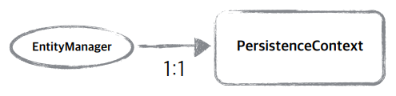
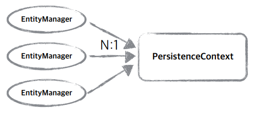
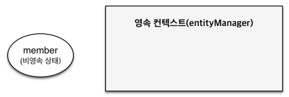
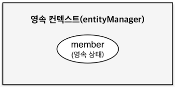

# 영속성 관리
JPA를 이해하려면 영속성 컨텍스트(Persistence Context)라는 것을 이해해야 한다.  

<br>

### JPA에서 가장 중요한 2가지
* 객체와 관계형 데이터베이스 매핑하기(Object Relational Mapping)
  * 정적 관점
* **영속성 컨텍스트(Persistence Context)**
  * 동적 관점(내부 동작)

영속성 컨텍스트에 대해 알아보자.

<br>

### 엔티티 매니저 팩토리와 엔티티 매니저


<br>

### 영속성 컨텍스트
* JPA를 이해하는데 가장 중요한 용어
* "엔티티를 영구 저장하는 환경(문맥)"이라는 뜻
* ```EntityManager.persist(entity);```
  * 객체를 DB에 저장한다는 개념 이전에 영속성 컨텍스트를 통해 엔티티를 영속화한다는 개념이 있다
* 영속성 컨텍스트는 논리적인 개념으로 눈에 보이지 않는다
* 엔티티 매니저를 통해서 영속성 컨텍스트에 접근
  * #### J2SE 환경
    * 엔티티 매니저와 영속성 컨텍스트가 1:1  
    
  * #### J2EE, 스프링 프에미워크 같은 컨테이너 환경
    * 엔티티 매니저와 영속성 컨텍스트가 N:1  
    

<br>

### 엔티티의 생명주기


* **비영속 (new/transient)**
  * 영속성 컨텍스트와 전혀 관계가 없는 새로운 상태  
  
    ```java
    //객체를 생성한 상태(비영속)
    Member member = new Member();
    member.setId("member1");
    member.setUsername("회원1");
    ```
* **영속 (managed)**
  * 영속성 컨텍스트에 관리되는 상태  
  
    ```java
    //객체를 생성한 상태(비영속)
    Member member = new Member();
    member.setId("member1");
    member.setUsername("회원1");
  
    EntityManager em = emf.createdEntityManager();
    em.getTransaction().begin();
  
    //객체를 저장한 상태(영속)
    em.persist(member);
    ```
* **준영속 (detached)**
  * 영속성 컨텍스트에 저장되었다가 분리된 상태
    ```java
    //회원 엔티티를 영속성 컨텍스트에서 분리, 준영속 상태
    em.detach(member);
    ```
* **삭제 (removed)**
  * 삭제된 상태
    ```java
    //객체를 삭제한 상태(삭제)
    em.remove(member);
    ```