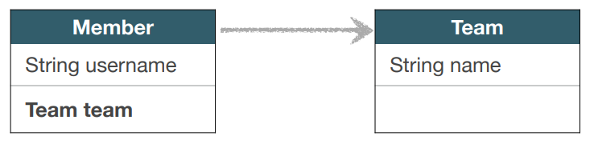

# 프록시

<br>

## 언제 사용해야 할까?
### 예시) Member를 조회할 때 Team도 함께 조회해야 할까?
  
  
* 함께 조회 해야 할 때도 있고-
  ```java
  //회원과 팀 함께 출력
  public void printUserAndTeam(String memberId) {
      Member member = em.find(Member.class, memberId);
      Team team = member.getTeam();
      System.out.println("회원 이름: " + member.getUsername());
      System.out.println("소속팀: " + team.getName());
  }
  ```
* 아닐 때도 있다.
  ```java
  //회원만 출력
  public void printUser(String memberId) {
      Member member = em.find(Member.class, memberId);
      Team team = member.getTeam();
      System.out.println("회원 이름: " + member.getUsername());
  }
  ```
  
* 위 예시를 토대로 어떤 상황을 가정해보자.  
  보통의 경우에는 회원과 팀을 같이 사용하고, 어느 특정 상황에서만 회원만 사용하도록 하고 싶다.  
  이런 경우 가끔 회원만 조회할 때 사용하지 않는 팀도 조회가 되게 된다. 그러면 애플리케이션에 낭비가 생기게 되는데, 자원을 효율적으로 사용하기 위해 JPA가 내장하고 있는 **_프록시_** 와 **_지연로딩_** 을 사용하면 이러한 낭비를 최소화 할 수 있다.  
  
<br>

## 프록시 기초
* ```em.find()``` vs ```em.getReference()```
* ```em.find()```: 데이터베이스를 통해서 실제 엔티티 객체 조회
* ### ```em.getReference()```: 
  * **_데이터베이스 조회를 미루는 가짜(프록시) 엔티티 객체 조회_**
  * 쉽게 말하자면```em.getReference()```를 실행하는 시점에는 DB의 쿼리를 실행하지 않는데, 영속성 컨텍스트에는 없는 값을 사용하는 시점에서 DB에 쿼리를 날려서 객체를 채워 반환한다.
    * ```java
      Member findMember = em.getReference(Member.class, member.getId()); //쿼리 실행 X
      System.out.println("findMember.id = " + findMember.getId()); //위 라인 코드로 인해 영속성 컨텍스트에 Id가 있기 때문에 쿼리 실행 X 
      System.out.println("findMember.username = " + findMember.getUsername()); //영속성 컨텍스트에 username이 없기 때문에 쿼리 실행 O
      ```
  * 그렇다면 임시로 만들어지는 객체의 정체는 뭘까?  
    * ```System.out.println(findMember.getClass());```  
      출력 : ```class helloJpa.Member$HibernateProxy$odcVhpjy```
    * 출력된 내용을 보면 Hibernate가 만들어낸 가짜 클래스라는 것을 알 수 있다. 속칭 프록시라고 하는 가짜 엔티티 객체를 만들어주는데, 이를 ```프록시 클래스``` 라 한다.
  * 아래의 그림으로 정말 간단하게 가짜 엔티티 객체의 매커니즘을 살펴보자.    
    
    * 진짜 객체와 껍데기는 똑같은데 안이 텅텅 빈 모습으로 내부의 Target이 진짜 레퍼런스를 가리키고 있는 구조다.
    * 더 자세한건 아래의 특징에서 살펴보자.

<br>

## 프록시 특징
* 실제 클래스를 상속 받아서 만들어진다. 그래서 실제 클래스와 겉 모습이 같다.  
  
* 사용하는 입장에서는 진짜 객체인지 프록시 객체인지 구분하지 않고 사용하면 된다.(이론상)
* 프록시 객체는 실제 객체의 참조(target)을 보관한다.
* 프록시 객체를 호출하면 프록시 객체는 실제 객체의 메소드를 호출해준다.  
  
* 메커니즘을 살펴보자.

<br>

## 프록시 객체의 초기화 매커니즘
  
1. ```member.getName();``` 호출을 하면 ```Member target```에 초기 값이 없는 걸 확인
2. JPA가 영속성 컨텍스트에게 실제 DB에서 가져오라고 요청(영속성 컨텍스트를 통해서 초기화 요청)
3. 영속성 컨텍스트가 DB에서 조회하여서 실제 엔티티 객체를 생성
4. 프록시 객체 ```target``` 에 실제 엔티티 객체를 연결
5. ```member.getName();```요청을 수행(```target```을 통해 실제 엔티티 객체 값을 반환)

<br>

## 프록시의 특징
다시 돌아가서 프록시의 특징에 대해 살펴보자.
* 프록시 객체는 처음 사용할 때 한 번만 초기화된다.(영속성 컨텍스트에 저장해두고 재사용)
* **_프록시 객체를 초기화 할 때, 프록시 객체가 실제 엔티티로 바뀌는 것은 아니다_**. 초기화 되면 프록시 객체를 통해서 실제 엔티티에 접근 가능한 것일뿐이다.

<br>

* 프록시 객체는 원본 엔티티를 상속받는다. 따라서 타입 체크시 주의해야 한다(```==``` 비교 실패, 대신 ```instance of``` 사용)
  * 타입 체크 예시
    ```java
    Member member1 = new Member();
    member1.setUsername("member1");
    em.persist(member1);
    
    Member member2 = new Member();
    member2.setUsername("member2");
    em.persist(member2);
    
    Member member3 = new Member();
    member3.setUsername("member3");
    em.persist(member3);
    
    em.flush();
    em.clear();
    
    Member m1 = em.find(Member.class, member1.getId());
    Member m2 = em.find(Member.class, member2.getId());
    Member m3 = em.getReference(Member.class, member3.getId());
    
    System.out.println("m1 == m2: " + (m1.getClass() == m2.getClass())); // true
    System.out.println("m1 == m3: " + (m1.getClass() == m3.getClass())); // false
    
    //당연히 매개변수를 일일이 확인하면 분간이 가겠지만, 실무에서는 아래와 같이 사용하기 때문이다. 
    logic(m2, m3); //false
    logic2(m2, m3); //true
    
    
    //아래만 보면 Member 매개변수가 "실제 객체"인지 "프록시 객체"인지 구별하지 못한다.
    private static void logic(Member m2, Member m3) {
        System.out.println("m2 == m3: " + (m2.getClass() == m3.getClass()));
    }
    
    //타입체크시 == 을 쓰지말고 instanceof 를 사용하자.
    private static void logic2(Member m2, Member m3) {
        System.out.println("m2 == m3: " + (m2 instanceof Member);
        System.out.println("m2 == m3: " + (m3 instanceof Member);
    }
    ```
    
<br>

* 영속성 컨텍스트에 찾는 엔티티가 이미 있으면 ```em.getReference()```를 호출해도 실제 엔티티를 반환한다.
    ```java
    Member member1 = new Member();
    member1.setUsername("member1");
    em.persist(member1);
    
    em.flush();
    em.clear();

    Member m1 = em.find(Member.class, member1.getId());
    Member reference = em.getReference(Member.class, member1.getId());
    
    //두 값이 동일하다.
    System.out.println(m1.getClass());
    System.out.println(reference.getClass());
    ```
  1. 이미 조회하여 영속성 컨텍스트(1차 캐시)에 올려놨으면 프록시 객체를 생성할 이유가 없다.(성능 최적화면에서도 이점)
  2. JPA가 기본적으로 제공하는 매커니즘 중 하나로 PK가 똑같으면 항상 true 반환을 보장해줘야 한다.(java 컬렉션에서의 == 비교처럼.)
     1. ```getReference()```를 두 번 사용해서 같은 PK 객체를 프록시로 두 번 생성해서 첫 번째 프록시 객체와 두 번재 프록시 객체를 비교(==)해도 true를 반환한다.(즉 프록시 객체를 2번 호출해도 같은 객체다)
     2. 같은 PK 객체를 프록시 객체로 먼저 생성(```getReference()```)하고 두 번째로 ```find```로 실제 객체를 생성해서 비교(==)를 해도 성립(true)이 된다. ```find```로 객체를 생성하려고 해도 ```getReference()```로 먼저 생성된 프록시 객체가 있기 때문에 그걸 재사용하는 것이다.(== 비교를 보장하기 위해서)
  3. 위의 내용의 핵심은 **_우리가 개발을 할 때 Proxy든 실제 객체든 크게 문제가 없게 개발하는 것이 중요하다_** 는 것이다.

<br>

* 영속성 컨텍스트의 도움을 받을 수 없는 준영속 상태일 때, 프록시를 초기화하면 문제 발생(실무에서 많이 마추지게 된다.)  
  (하이버네이트는 ```org.hibernate.LazyInitializationException``` 예외를 터트림)
  ```java
  Member member1 = new Member();
  member1.setUsername("member1");
  em.persist(member1);

  em.flush();
  em.clear();

  Member reference = em.getReference(Member.class, member1.getId());
  
  System.out.println(reference.getClass()); //Proxy
  
  em.detach(reference); //영속성 컨텍스트에서 reference를 끄집어내거나-
  em.close(); //영속성 컨텍스트를 끄거나-
  em.clear(); //영속성 컨텍스트를 지움.
  
  System.out.println(reference.getUsername()); //데이터를 불러와야하는데 영속성 컨텍스트에 존재하지 않아서 예외발생.
  ```
  
<br>

## 프록시 확인
* 프록시 인스턴스의 초기화 여부 확인  
  ```emf.PersistenceUnitUtil.isLoaded(Object entity)```
* 프록시 클래스 확인 방법  
  ```entity.getClass().getName()``` 출력(..javasist.. or HibernateProxy…)
* 프록시 강제 초기화  
  ```org.hibernate.Hibernate.initialize(entity);```
* 참고: JPA 표준은 강제 초기화 없음  
  강제 호출: ```member.getName()```

<br>

### 실무에서 프록시를 많이 사용할까?
거의 안 쓴다.  
하지만 이러한 프록시의 메커니즘을 이해해야 **_즉시 로딩_** 과 **_지연 로딩_** 에 대해서 깊이 있게 이해할 수가 있다.

<br>

---

# 즉시 로딩과 지연 로딩

<br>

## 지연 로딩, LAZY을 사용해서 프록시로 조회
* ### 예시) ```Member``` 객체를 90% 사용하고, ```Team```객체를 가끔 사용한다면?
  ```java
  @Entity
   public class Member {
      
       @Id
       @GeneratedValue
       private Long id;
       
       @Column(name = "USERNAME")
       private String name;
       
       @ManyToOne(fetch = FetchType.LAZY) //fetch 타입을 LAZY로 세팅하면 proxy로 가져온다.
       @JoinColumn(name = "TEAM_ID")
       private Team team;
       
       ...
   }
  ```
  * ```@ManyToOne(fetch = FetchType.LAZY)```
    
  
  * ### 지연 로딩 LAZY를 사용해서 프록시로 조회
    

<br>

* ### 예시) 반대로 ```Member``` 객체와 ```Team``` 객체를 자주 함께 사용한다면?
  * 즉시 로딩 EAGER를 사용해서 함께 조회
    ```java
    @Entity
    public class Member {
        @Id
        @GeneratedValue
        private Long id;
    
        @Column(name = "USERNAME")
        private String name;
    
        @ManyToOne(fetch = FetchType.EAGER) //
        @JoinColumn(name = "TEAM_ID")
        private Team team;
        
        ...
    }
    ```
  * ```@ManyToOne(fetch = FetchType.EAGER)```
    
  * ### 즉시 로딩(EAGER), Member조회시 항상 Team도 조회
    

<br>

## 프록시와 즉시 로딩 주의
* **_가급적 지연 로딩만 사용(특히 실무에서-)_**
  * 테이블이 복잡하게 얽혀있는 상황에서는 쿼리가 엄청나게 방대해질 수 있기때문에 성능저하를 일으킨다.
* 즉시 로딩을 적용하면 예상하지 못한 SQL이 발생한다.
* **_즉시 로딩은 JPQL에서 N+1 문제를 일으킨다._**
  * N+1? 결과가 10개면 N이 10이 되는 것으로 1은 최초 쿼리를 말한다. 즉, 쿼리를 하나 날렸는데 그것 때문에 추가 쿼리가 N개가 실행된다고 해서 N+1이라 한다.
* ```@ManyToOne```, ```@OneToOne```은 **_기본이 즉시 로딩 -> LAZY로 설정_**
* ```@OneToMany```, ```@ManyToMany```는 기본이 지연 로딩

<br>

## 지연 로딩 활용
> 주의: 해당 예제는 이론을 보여주기 위한 예제로 실무에서는 지연 로딩만 사용하도록 하자.  
* ```Member```와 ```Team```은 자주 함께 사용 -> 즉시 로딩
* ``Member``와 ```Order```는 가끔 사용 -> 지연 로딩
* ```Order```와 ```Product```는 자주 함께 사용 -> 즉시 로딩  
    
    
  

<br>

## 지연 로딩 활용 - 실무
* ### **_실무에서 즉시 로딩을 사용하지 말고, 모든 연관관계에 지연 로딩을 사용해라!_**
* **_즉시 로딩이 필요하다면 JPQL fetch 조인이나, 엔티티 그래프 기능을 사용해라!_**

<br>

---

# 영속성 전이: CASCADE
* 특정 엔티티를 영속 상태로 만들 때 연관된 엔티티도 함께 영속상태로 만들도 싶을 때 사용한다.(지연로딩, 즉시로딩과 전혀 관계 없다)
* 예시) 부모 엔티티를 저장할 때 자식 엔티티도 함께 저장

<br>

## 영속성 전이: 저장
```@OneToMany(mappedBy="parent", cascade=CascadeType.PERSIST)```  

  
  * [Parent.java](../../src/main/java/hellojpa/permanenceTransition/Parent.java)
  * [Child.java](../../src/main/java/hellojpa/permanenceTransition/Child.java)

<br>

## 영속성 전이: CASCADE - 주의!
* 영속성 전이는 연관관계를 매핑하는 것과 아무 관련이 없다.
* 엔티티를 영속화할 때 연관된 엔티티도 함께 영속화하는 편리함을 제공할 뿐
* 실무 사용 주의사항으로는 자식 객체를 부모 객체만 관리 할 때, 즉 **_CASCADE할 객체의 소유자가 하나 일 때만 사용하는 것이 좋다._**  
  다시 한 번 말하면 자식 객체가 단일 엔티티에 종속적 일 때, 라이프 사이클이 유사할 때 사용하는 것이 바람직하다. 그렇지 않으면 운영 및 유지보수에 지장이 있을 수 있다.

<br>

## CASCADE의 종류
* **_ALL: 모두 적용_**
* **_PERSIST: 영속_**
* **_REMOVE: 삭제_**
* MERGE: 병합
* REFRESH: REFRESH
* DETACH: DETACH

<br>

# 고아 객체
* 부모 엔티티와 연관관계가 끊어진 자식 엔티티를 자동으로 삭제해주는 기능
* ```orphanRemoval = true```
* ```java
  Parent parent1 = em.find(Parent.class, id);
  parent1.getChildren().remove(0);
  //자식 엔티티를 컬렉션에서 제거되면 자동으로 DELETE 쿼리 실행
  //DELETE FROM CHILD WHERE ID=?
  ```
  
<br>

## 고아 객체 - 주의
* 참조가 제거된 엔티티는 다른 곳에서 참조하지 않는 고아 객체로 보고 삭제하는 기능
* **_참조하는 곳이 하나일 때 사용해야 한다!_**
* **_특정 엔티티가 개인 소유할 때 사용_**
* ```@OneToOne```, ```@OneToMany```만 가능
* 참고: 개념적으로 부모를 제거하면 자식은 고아가 된다. 따라서 고아 객체 제거 기능을 활성화 하면, 부모를 제거할 때 자식도 함께 제거된다. 이것은 ```CascadeType.REMOVE```처럼 동작한다.

<br>

# 영속성 전이 + 고아 객체, 생명주기
* ```CascadeType.ALL``` + ```orphanRemoval=true```
* 스스로 생명주기를 관리하는 엔티티는 ```em.persist()```로 영속화, ```em.remove()```로 제거하며 스스로 관리한다.
  하지만 위의 두 옵션을 모두 활성화 하면 부모 엔티티를 통해서 자식의 생명 주기를 관리할 수 있다.
* 도메인 주도 설계(DDD)의 Aggregate Root개념을 구현할 때 유용하다.