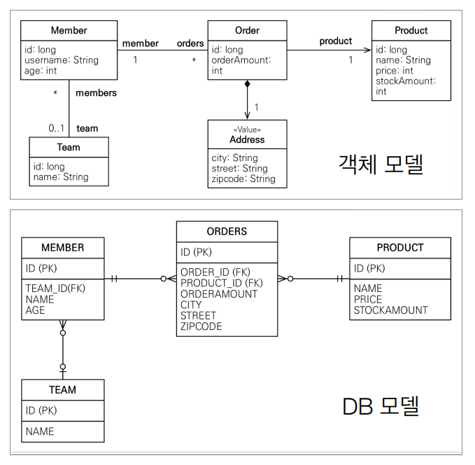

# JPQL(Java Persistence Query Language)

<br>

## JPQL - 기본 문법과 기능

<br>

### JPQL 소개
* JPQL은 객체지향 쿼리 언어다. 따라서 테이블을 대상으로 쿼리하는 것이 아니라 **_엔티티 객체를 대상으로 쿼리_** 한다.
* JPQL은 SQL을 추상화해서 특정데이터베이스 SQL에 의존하지 않는다.
* JPQL은 결국 SQL로 변환된다.(맵핑 정보 + DB 방언 = SQL)



<br>

### JPQL 문법
```
select_문 :: =
    select_절
    from_절
    [where_절]
    [groupby_절]
    [having_절]
    [orderby_절]
    
update_문 :: = update_절 [where_절]
delete_문 :: = delete_절 [where_절]
```

* ```select m from Member as m where m.age > 18```
* 엔티티와 속성은 대소문자 구분한다. (```Member```, ```age```)
* JPQL 키워드는 대소문자 구분하지 않는다. (```SELECT```, ```FROM```, ```where```)
* 엔티티 이름 사용, 테이블 이름이 아니다.(```Member```)
* **_별칭은 필수(```m```)_** (```as```는 생략가능)

<br>

### 집합과 정렬
```
select
    COUNT(m), //회원수
    SUM(m.age), //나이 합
    AVG(m.age), //평균 나이
    MAX(m.age), //최대 나이
    MIN(m.age) //최소 나이
from Member m
```
* ```GROUP BY```, ```HAVING```
* ```ORDER BY```

<br>

### TypeQuery, Query
* TypeQuery: 반환 타입이 명확할 때 사용
* Query: 반환 타입이 명확하지 않을 때 사용
```java
TypedQuery<Member> query = em.createQuery("SELECT m FROM Member m", Member.class);
```
```java
Query query = em.createQuery("SELECT m.username, m.age from Member m"); 
```

<br>

### 결과 조회 API
* ```query.getResultList()```: 결과가 하나 이상일 때, 리스트 반환
  * 결과가 없으면 빈 리스트 반환
* ```query.getSingleResult()```: 결과가 정확히 하나, 단일 객체 반환
  * 결과가 없으면: ```javax.persistence.NoResultException```
  * 둘 이상이면: ```javax.persistence.NonUniqueResultException```

<br>

### 파라미터 바인딩 - 이름 기준, 위치 기준
```
SELECT m FROM Member m where m.username=:username
        
query.setParameter("username", usernameParam);
```
```
SELECT m FROM Member m where m.username=?1

query.setParameter(1, usernameParam);
```
* 위치 기반 파라미터 바인딩은 웬만하면 안쓰는 게 좋다. 작은 실수가 장애로 이어질 수 있다. 